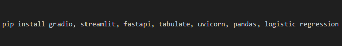
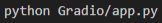
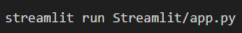
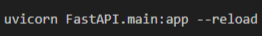
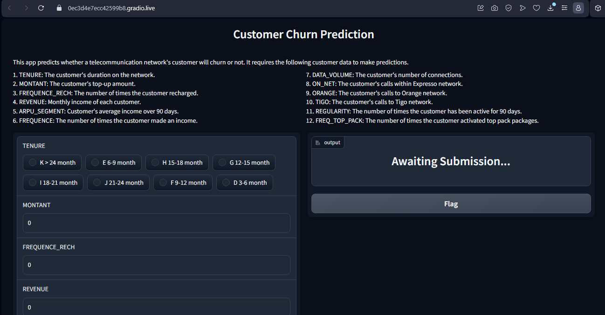
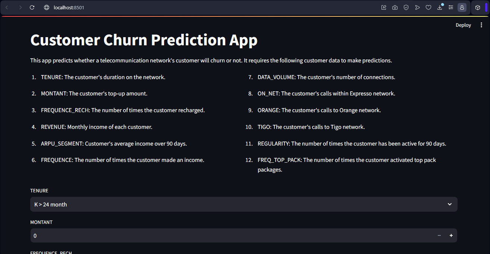
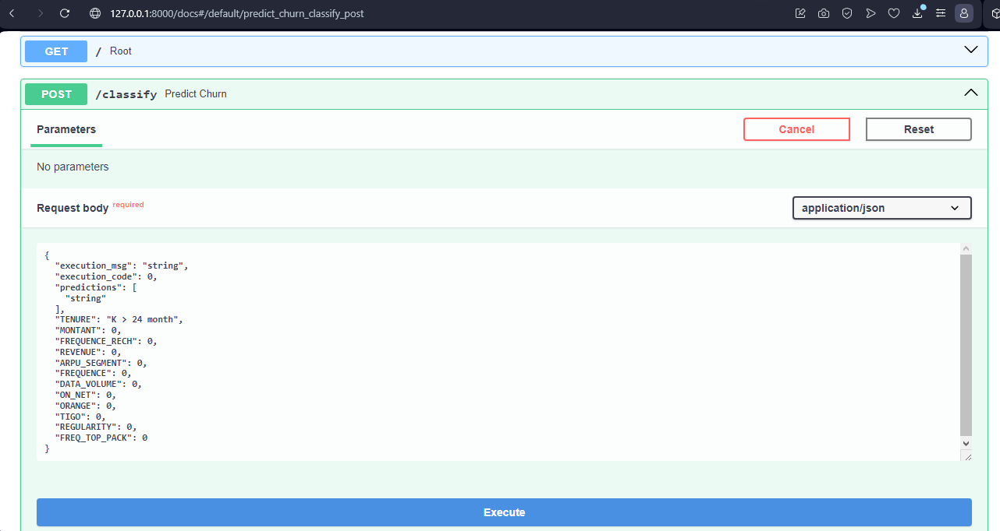

# EXPRESSO CUSTOMER CHURN CHALLENGE ON ZINDI

## Technologies

## Project Description

Welcome to **Expresso Customer Churn Challenge On Zindi**. The aim of this challenge is to analyze the customer churn data of Expresso, a prominent telecommunication network. Afterwards, Machine Learning models will be trained to predict customer churn for the company using the customer churn data. The best model will be selected based on the AUC scores of the trained models. This best model will be used to make predictions on new customer data that it has not seen before. This will help the company monitor the churn tendencies of their customers, enabling them to know in advance the customers that are likely to churn, and make informed business decisions aimed at retaining these customers. The predictions, along with the user_ids of the customers on the new customer data, will be saved as a csv file for submission on Zindi.

The best model, along with other Machine Learning components (such as the imputer, encoder, and scaler) used to prepare the customer churn data for modelling will be exported using pickle. They will then be used to build user-friendly apps using Gradio and Streamlit libraries, as well as a FastAPI web interface. These will simplify the usage of the model to make customer churn predictions for new customers based on their available data. Finally, these apps and API will be containerized using docker and deployed to Huggingface to make them publicly available.

## Preview

Below is a preview showcasing some features of the notebook:

    

        
Overall Churn Rate Of The Telecommunication Network

        
    

    

        
Churn Rate by Tenure

        
        

    

        
Churn Rate by Region

        
        

    

        
Confusion Matrix of the Best Model

        
    

    

        
Precision-Recall Curve of the Best Model

        
    

## Project Overview

The project includes the following stages:

### 1. Data Collection

- The datasets were downloaded directly from Zindi. They were not uploaded to the Github repository as it is against Zindi's rules to publicly upload competition datasets.

- These datasets were mounted on Google Drive for ease in loading and execution on Google Colab.

### 3. Exploratory Data Analysis (EDA)

- Checking missing values
- Checking duplicates
- Checking shapes of the datasets
- Visualizing the columns of the train dataset
- Hypothesis testing
- Answering analytical questions with visualizations
- Creating new features in order to answer analytical questioons

### 4. Answering Questions with Visualizations

**Questions:**

- What is the overall churn rate of the telecommunication company?
- What is the churn rate across the various regions?
- What is the churn rate of custmers based on customer regularity?
- What is the churn rate of customers based on their tenure?
- What is the churn rate of customers based on the top_up amounts?
- What is the churn rate of top pack users?
- What is the churn rate based on the data volume?
- What is the churn rate of custmers based on their income frequency?
- What is the churn rate of customers based on their monthly income?
- What is the relationship between the monthly income of customers and the frequency of recharge?
- What is the relationship between the number of times a customer made an income and the number of times a customer activated the top pack?
- What is the churn distribution of customers based on calls to Zone1 and Zone 2?
- What is the churn distribution of customers based international calls, calls to Orange, and calls to Tigo?

**Visualization Tools:**

The following visualization tools were used to create visuals on the notebook:

- Matplotlib
- Seaborn

### 5. Feature Engineering

The following feature engineering processes were carried out:

- Feature Selection
- Data Sampling
- Feature Extraction
- Data Splitting
- Imputation with SimpleImputer
- Feature Encoding with LabelEncoder
- Feature Scaling with StandardScaler
- Class Balancing

### 6. Model Training

The following models were trained and evaluated using the training and validation sets:

- Logistic Regression
- Random Forest
- Gradient Boosting
- Adaptive Boosting
- Decision Tree
- Gaussian Naive Bayes

### 7. Model Evaluation

The following metrics were used to evaluate the models:

- Accuracy
- Precision
- Recall
- F1 Score
- Area Under the Curve (AUC) - Primary evaluation metric

### 8. Hyperparameter Tuning

The best model was tuned and isolated using GridSearchCV.

## Prediction on Test Dataset

The best model was used to make predictions on the test dataset. A new 'CHURN' column was created on the dataset and filled with the churn predictions of each customer.

## Submission

A submission csv file was created bearing the user_id of each customer on the Test dataset and their churn predictions. This file was submitted on Zindi.

### 9. Exportation

The Machine Learning components (imputer, scaler, encoder, and best model) were exported with these libraries:

- os
- pickle

## Deployment to Power BI

The datasets were deployed to Power BI and nice visualizations were made. Click on the link below to see the Power BI visualizations.

[EXPRESSO CUSTOMER CHURN DASHBOARD](https://app.powerbi.com/links/IkzpEY0uDL?ctid=4487b52f-f118-4830-b49d-3c298cb71075&pbi_source=linkShare)

## Setup

To set up and run the notebook, apps and API in your local environment, follow these instructions in your terminal/bash:

1. Clone this repository to your local machine. Replace \<repository-url\> with the actual url to this repository:

2. Create and activate a virtual environment:

3. Install requirements.txt:

4. Install these ibraries in your virtual environment:

* Gradio
* Streamlit
* FastAPI
* Tabulate
* Uvicorn
* Pandas
* Scikit-Learn

These libraries can be installed by runing the following command in your terminal:

## Run the Apps and Web API

You can run the apps and API using the following commands:

- For Gradio

- For Streamlit

- For FastAPI

Each of the apps and API will be launched in your default web browser and can then be used to make predictions based on the customer information provided.

## Deployment to HuggingFace

The apps and API were deployed to HuggingFace. Click on the links below to acess them.

[Expresso-Customer-Churn-Challenge-Gradio-App](https://huggingface.co/spaces/iameberedavid/Expresso-Customer-Churn-Challenge-Gradio-App)

## Apps and API Interfaces

## Apps and API Usage Instructions

- Description: Each app has a description that explains the inputs to be made in the Input Fields.

- Input Fields: The apps will display input fields for the customer information.

- Prediction: Click the "Submit", "Predict Customer Churn", or "Execute" button to get a prediction based on the provided inputs on the Gradio, Streamlit or FAstAPI interface respectively.

- Results: Each app will display whether the customer is likely to churn or not based on the customer data in the input field.

## Authors

| Name | Profile | Portfolio | Articles | Contact |
| ---- | ------- | --------- | -------- | ------- |
| Chidiebere David Ogbonna | [LinkedIn](https://www.linkedin.com/in/chidieberedavidogbonna/) | [GitHub](https://github.com/iameberedavid) | [Medium](https://eberedavid.medium.com) | eberedavid326@gmail.com |
| George Manuel | [LinkedIn](www.linkedin.com/in/george-manuel95) | [GitHub](https://github.com/George-Manuel) | [Medium](george-manuel.medium.com) | georgemanuel1990.gm@gmail.com |
| Kwaku Twum-Ampofo | [LinkedIn](https://www.linkedin.com/in/kwaku-twum-ampofo/) | [GitHub](https://github.com/KwakuTwum) | [Medium](https://medium.com/@ktwumampofo77) | ktwumampofo77@gmail.com |
| Rucyaha Christian | [LinkedIn](www.linkedin.com/in/rucyaha-christian) | [GitHub](https://github.com/Rucyaha) | [LinkedIn](www.linkedin.com/in/rucyaha-christian) | rucyachris32@gmail.com |
| Prince Agyei Asamoah | [LinkedIn](https://gh.linkedin.com/in/prince-asamoah) | [GitHub](https://github.com/Princeasamoah) | [Medium](https://medium.com/@prince.asamoah17) | prince.asamoah17@gmail.com |

## Acknowledgments

We would like to express our gratitude to the [Azubi Africa Data Analyst Program](https://www.azubiafrica.org/data-analytics) for their support and for offering valuable projects as part of this program. Not forgeting our scrum masters [Rachel Appiah-Kubi](https://www.linkedin.com/in/racheal-appiah-kubi/) & [Emmanuel Koupoh](https://github.com/eaedk)

## License

This project is licensed under the MIT License - see the [LICENSE.md](LICENSE.md) file for details.

## Contact

For questions, feedback, and collaborations, please send a mail to: eberedavid326@gmail.com